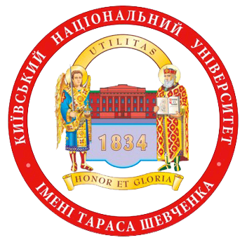

<!-- Main -->

	<!-- One -->
	<section id="one">
		

			<header class="major">
				<h1>Work Experience</h1>
			</header>
			<dl>
				<dt>
					Project Manager Games
				<dd>
					<a href="https://www.redbullmediahouse.com/">
						
							<i class="fa fa-certificate" aria-hidden="true"></i>
							Red Bull
							<i class="fa fa-calendar-o" aria-hidden="true"></i>
							May 2018 - present
						
					</a>
				</dd>
				</dt>
				<dd>
					
Managing mobile and console game development for Red Bull Media House. So far, I've worked on
						Bike Unchained 2 (iOS & Android) and Snowboarding The Next Phase (Nintendo Switch) games. More
						to come! 🎉

				</dd>
				<dt>
					Community Management & Tech Support Lead
				<dd>
					<a href="https://company.plarium.com/">
						
							<i class="fa fa-certificate" aria-hidden="true"></i>
							Plarium Global
							<i class="fa fa-calendar-o" aria-hidden="true"></i>
							Apr 2017 - May 2018
						
					</a>
				</dd>
				</dt>
				<dd>
					<ul>
						<li>In charge of overall community management direction (SMM, push-notification campaigns,
							landing page design, etc.) </li>
						<li>management of the technical support department for the Kiev studio games (2 persons) </li>
						<li>Integrated new in-app mobile help desk that helps the Community department team (2 persons)
							to effectively handle requests from 500,000+ MAU </li>
						<li>Concurrently work on two game projects (FruitLand, Rio: Match 3 Party). </li>
					</ul>
				</dd>
				<dt>
					IT Project Manager
				<dd>
					<a href="http://dealboom.net/">
						
							<i class="fa fa-certificate" aria-hidden="true"></i>
							Dealboom.net
							<i class="fa fa-calendar-o" aria-hidden="true"></i>
							May 2017 - Jan 2018
						
					</a>
				</dd>
				</dt>
				<dd>
					<ul>
						<li>
							Created 12-person multi-language (BR, IT, DE, FR, ES, EN) freelance support team from
							scratch
						</li>
						<li>
							Creating and A/B testing of product landing pages
						</li>
						<li>
							Wireframing experience of CRM back-office pages (using https://app.moqups.com/)
						</li>
						<li>
							Project documentation, task management (use cases, GitHub wiki)
							Planning, task management, collaboration with developers, designers, marketing specialists,
							support, etc.
						</li>
					</ul>
				</dd>
				<dt>
					Community Manager
				<dd>
					<a href="http://www.gameloft.com/en/">
						
							<i class="fa fa-certificate" aria-hidden="true"></i>
							Gameloft
							<i class="fa fa-calendar-o" aria-hidden="true"></i>
							May 2016 - Apr 2017
						
					</a>
				</dd>
				<dd>
					<ul>
						<li>
							Lead the team of 2 game moderators
						</li>
						<li>
							Monthly content planning, task management, weekly reporting to the HQ (France).
						</li>
						<li>
							Concurrently work on two world-class mobile gaming projects (Spider-Man Unlimited, World at
							Arms). The Spider-Man Unlimited game has over 15 million downloads (iOS & Android) and had
							400,000+ daily active users.
						</li>
						<li>
							Provided creative/marketing solutions, such as social media marketing, for Spider-Man
							Unlimited game, which led to the organic acquisition of 151,021 unique users, which is a
							21.64% increase compared to the previous year, the reach of the official Facebook page has
							raised by 59.42%, the engagement rate by 22.67%.
						</li>
						<li>
							Constant collaboration with the licensor of the game – Marvel Entertainment (USA). Approval
							of the assets, texts, legal requirements, negotiation regarding the content/features of
							Spider-Man Unlimited game updates/promos.
						</li>
					</ul>
				</dd>
				</dt>
			</dl>
			<header class="major">
				<h1>Education</h1>
			</header>
			<dl>
				<dt>
					<a href="http://www.univ.kiev.ua/en/">
						Taras Shevchenko National University of Kyiv
					</a>
					 
				<dd>
					

						

							

							

							

								<ul>
									<li>
										Master's degree in Political Science
									</li>
									<li>
										Officer of Tactical-level operations
									</li>
								</ul>
							

						

					
